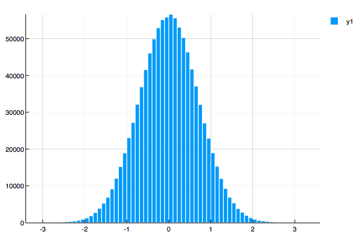

# Gauss-Distribution
**C++** and **Julia** Normal distribution generated with uniform distribution

###### Plot generated with Julia Plotly  
  

* *gauss.il* - contains Julia implementation of Gauss Dist. with plot generator Plotly  
* *gauss.sh* - contains Shell script to compile and generate C++ datagram .dat file
